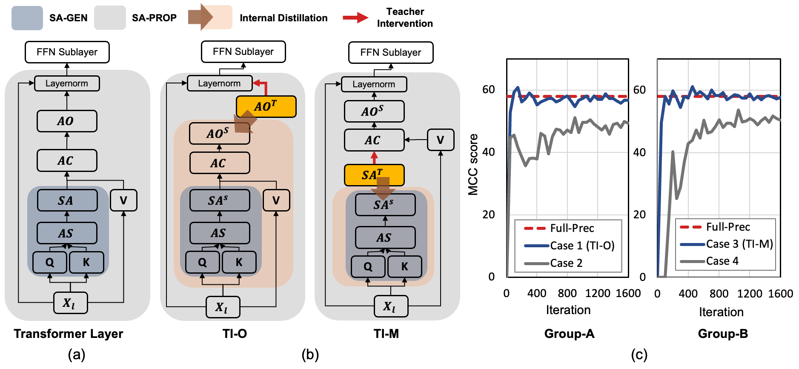
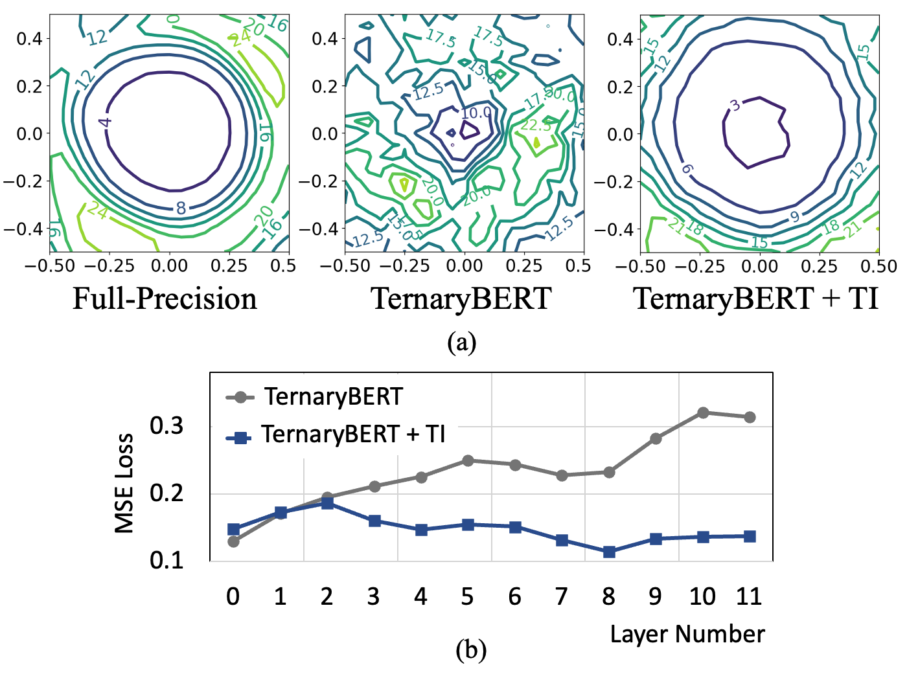
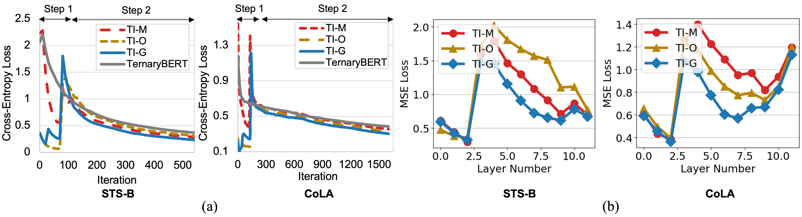
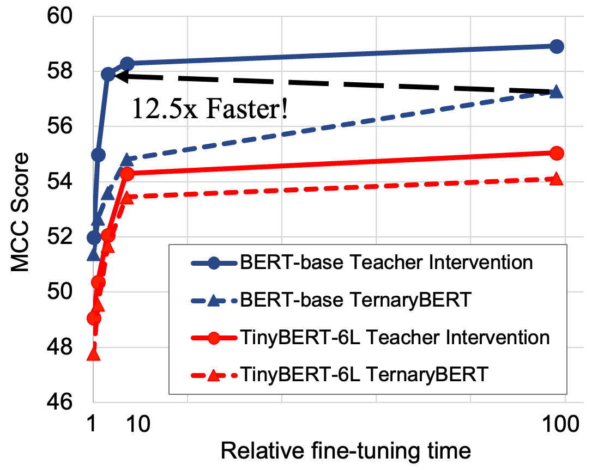

# Teacher Intervention : Improving Convergence of Quantization Aware Training for Ultra-Low Precision Transformers
This Repository provides a Pytorch implementation of **Teacher Intervention : Improving Convergence of Quantization Aware Training for Ultra-Low Precision Transformers** (EACL 2023 Main Track)

- This work proses a proactvie knowledge distillation method called ***Teacher Intervention*** (TI) for fast converging QAT of ultra-low precision pre-trained Transformers. (Figure 3)


<p align="center">

</p>

- TI intervenes layer-wise signal propagation with the non-errorneous signal form the Full-Precision Teacher model to remove the interference of propagated quantization errors, smoothing loss surface of QAT and expediting the convergence. (Figure 2)

<p align="center">

</p>

- Furthermore, we propose a ***gradual*** intervention mechanism to stabilize the recovery of subsections of Transformer layers from quantization. This unified intervention mechanism can manage diverse characteristics of fine-tuned Transformers for various downstream tasks. (Figure 4)

<p align="center">

</p>

- We perform an extensive evalauation on various fine-tuned Transformers (BERT-base/large (Devlin et al., NAACL 2019), TinyBERT-4L/6L (Jiao et al., EMNLP 2020), and SkipBERT-6L (Wu et al., NeurIPS 2022) for NLP, and ViT (Dosovitskiy et al., ICLR 2020) for CV) and demonstrate that TI consistently achieves superior accuracy with **lower fine-tuning iterations** compared to the state-of-the-art QAT methods. (In particular, TI outperforms TernaryBERT (Zhang et al., EMNLP 2020) on GLUE tasks with **12.5x savings** in fine-tuning hours. (Figure 1)

<p align="center">

</p>

## Getting Started

```
pip install -r requirements.txt
```

### Model
You can get GLUE task specific fine-tuned BERT base model using huggingface code. 
https://github.com/huggingface/transformers/tree/master/examples/pytorch/text-classification

### GLUE Dataset 
Download GLUE. 
https://github.com/nyu-mll/GLUE-baselines

### Teacher Intervention Two-Step QAT
Proposed TI method consists of Two Steps. (See Table-1 for detailed Two Step TI QAT)

1. Teacher Intervention is employed to finetune quantized weights of either FFN or SA-PROP sub-layers of Transformers. (Convergence in this step is very quick, as shown in Fig.3(c))
2. Quantization is applied to the entire weights of Transformer layers for QAT

You can easily run TI two step Training pipeline using bash scripts.

- In step-1, Turn-on TI options you want to try in the bash scripts. (e.g., for TI-G, set teacher_gradual=1)
- In step-2, Set `step1_option` argument same as step-1 training option. (e.g., for TI-G in step-1, step1_option=GRAD)
```
# Teacher Intervention (TI)
teacher_attnmap=0 # MI
teacher_context=0 # CI
teacher_output=0 # OI

# TI-G options 
teacher_gradual=1 # GRAD
teacher_stochastic=0 # STOCHASTIC
teacher_inverted=0 # INVERTED

# For step2
step1_option=GRAD # {MI, CI, OI, GRAD, INVERTED, STOCHASTIC}
```
Run two-step TI QAT for BERT base!
```
# For TI-QAT Step-1 Training 
bash run_TI_step_1.sh {GPU Num} {GLUE Task} 

# For TI-QAT Step-2 Training
bash run_TI_step_2.sh {GPU Num} {GLUE Task} 
```

For Data Augmentation (DA) Option, use TinyBERT Data Augmentation for getting expanded GLUE Dataset.

https://github.com/huawei-noah/Pretrained-Language-Model/tree/master/TinyBERT

## Reference
This Pytorch implementation is based on "TernaryBERT: Distillation-aware Ultra-low Bit BERT, Zhang et al, EMNLP 2020"  
[Git link](https://github.com/huawei-noah/Pretrained-Language-Model/tree/master/TernaryBERT)

